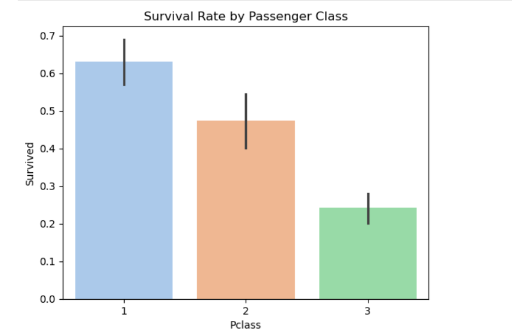
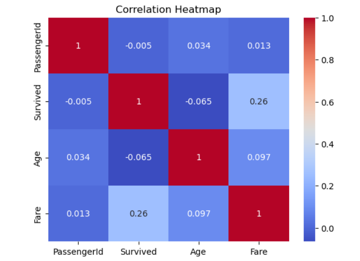
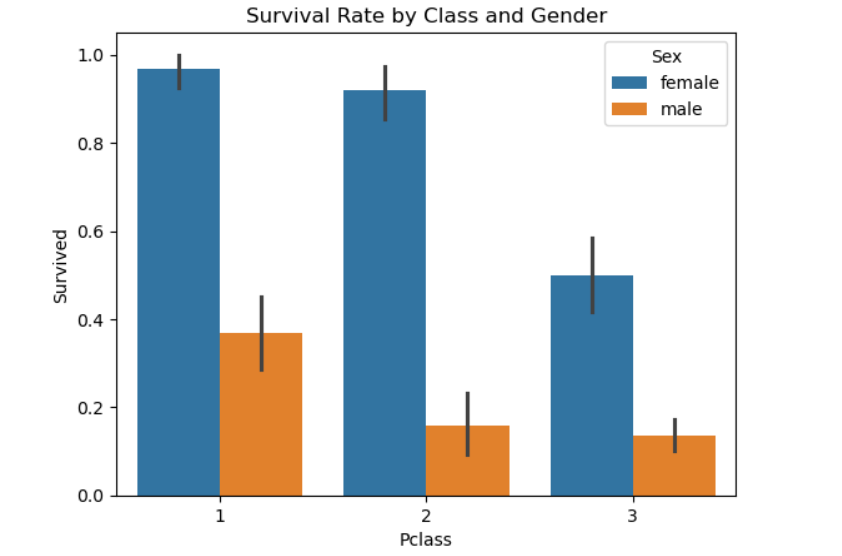

# 🚢 Titanic Dataset - Exploratory Data Analysis (EDA)

This repository contains a Jupyter Notebook that performs detailed **Exploratory Data Analysis (EDA)** on the classic **Titanic: Machine Learning from Disaster** dataset from Kaggle.

---

## 📊 Project Overview

The analysis covers:
- Data Cleaning: Handling missing values, dropping unneeded columns
- Type Conversion: Converting relevant features to categorical
- Group-based insights: Survival rate by gender, class, and port
- Visualization: Histograms, bar plots, and heatmaps
- Bonus: Cross-feature survival visualizations

---

## 📁 Dataset

Dataset used: [`train.csv`](https://www.kaggle.com/competitions/titanic/data)  
Make sure the dataset is in the same directory as the notebook.

---

## 🛠️ Tools & Libraries

- Python 3
- Pandas
- Matplotlib
- Seaborn
- Jupyter Notebook

---

## 🔍 Key Visualizations

- Survival Rate by Gender
- Survival Rate by Passenger Class
- Age Distribution by Survival
- Correlation Heatmap
- Survival by Gender and Embarkation Port

## Here are some visualizations

### 🎯 Survival Rate by Passenger Class

### 🧠 Correlation Heatmap

### 📈 Survival Rate by class and gender

---

## 📝 License

This project is for educational purposes. You are free to use or modify it with attribution.

---

## 👤 Author

Anas Farooq – *Data & ML Enthusiast*

Feel free to ⭐ this repo and share your feedback!
